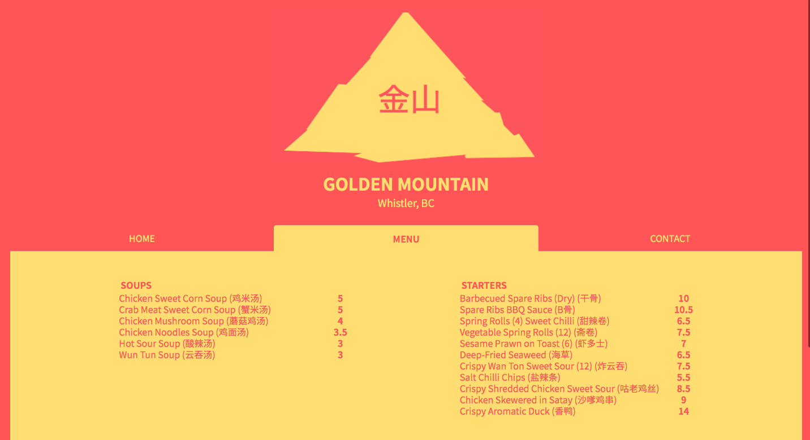

# Restaurant Page 

This project was completed for The Odin Project JavaScript Restaurant Page Assignment. 

This is created using Vanilla JavaScript. 

The aim of the project was to create an basic Restaurant Page, built of modules for each component of the page. I used JavaScript alone to generate the entire contents of the website by using pure DOM manipulation  

In this porject we introduced NPM on the command line to install and use Webpack, along with JSON files for the webpacks config and also to store some of the 'restaurants' menu information. 

To see the full list of the project outlines along with other submission visit the assignment page [The Odin Project: JavaScript Restaurant Page](https://www.theodinproject.com/courses/javascript/lessons/restaurant-page)

# 

## Table of contents

1. [Demo](#demo)
2. [Technologies](#technologies)
3. [Features](#features)
4. [Development](#development)
5. [License](#license)

## Demo

Here is the working live demo:
[https://benjamin-gambling.github.io/restaurant/](https://benjamin-gambling.github.io/restaurant/).

## Technologies

- Javascript Modules, ES6, Webpack , NPM 
- [Bootstrap](https://getbootstrap.com/)
- [MDB](https://mdbootstrap.com/)

  
  

## Features
- Simple one page website with CSS designed tabs
- JavaScript Modules combined using Webpack 
- JavaScript used to generate the entire contents of the website
- JSON data files for easy and quick website chages 
- Mobile friendly 

### Devlopment
- Create gallary for images of establishment and food
- More info on food and contents 
- Possibly create an online ordering feature (add/remove/quantitys)

## License

> You can check out the full license [here](LICENSE)

This project is licensed under the terms of the **MIT** license.
